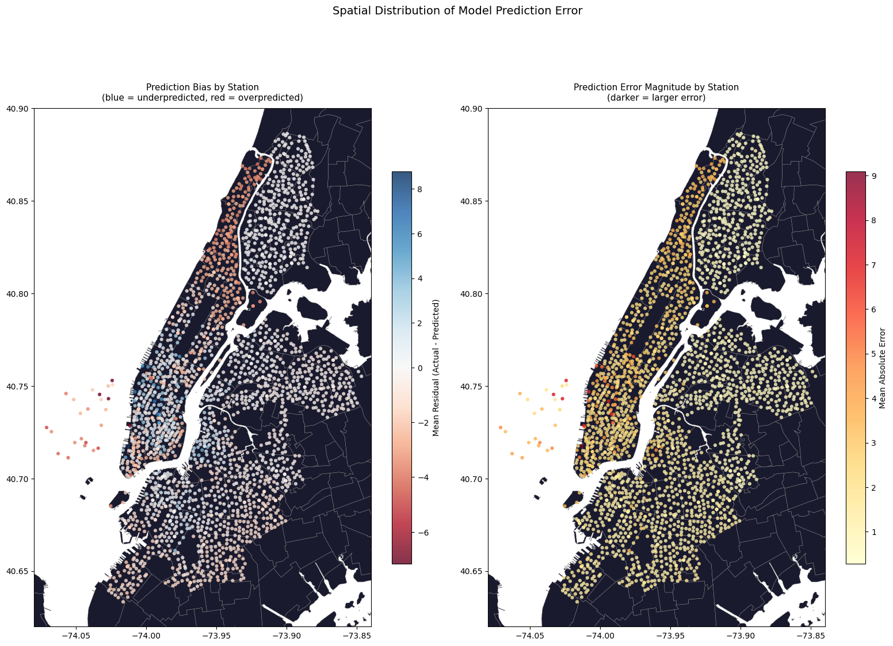
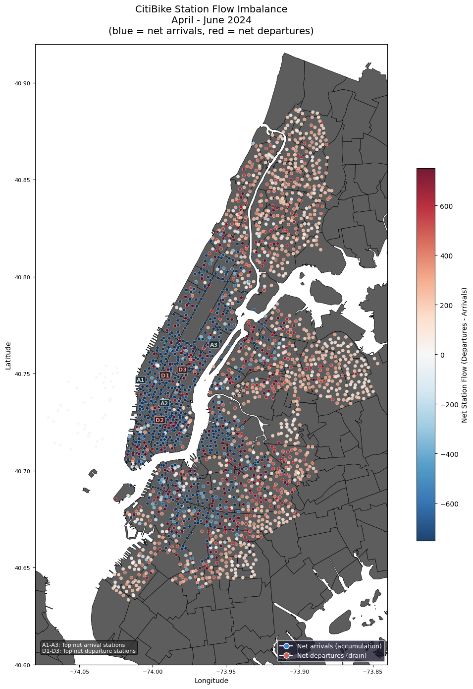

# CitiBike Spatiotemporal Ridership Analysis

Analysis and prediction of NYC CitiBike ridership patterns using historical trip data, weather observations, and geospatial neighborhood data across April-June 2024

This project aggregates ~5 million individual trips into hourly station-level counts, merged with weather and spatial data. This dataset is then analyzed and used to build predictive models to understand what drives ridership demand.

<div align="center">
  
  
</div>

### Data Sources
- [CitiBike System Ridership Data](https://s3.amazonaws.com/tripdata/index.html)
- [NOAA Local Climatological Data](https://ncei.noaa.gov/cdo-web/)
- [NYC Open Data](https://data.cityofnewyork.us)

## Setup

### Prerequisites
- Python 3.9+

### Installation
```bash
# clone repository
> git clone https://github.com/kacp3rrr/citibike-spatiotemporal-analysis
> cd citibike-spatiotemporal-analysis

# create and activate virtual env
python -m venv venv
source venv/bin/activate # Mac/Linux
venv\Scripts\activate    # Windows

# install dependencies from requirements.txt file
pip install -r requirements.txt
```

### Data Setup

Most raw data is already included in the repository. The only thing I was unable to include due to file size limitations is the CitiBike trip data, but it is the most trivial of the raw data to download:

- Go to the S3 bucket located at https://citibikenyc.com/system-data
- Download monthly ZIP files for **April, May, and June 2024**
- The best approach is to choose two CSV files from each month. I recommend choosing the first and second to last one from each month (annotated by file suffix), as it tends to form the best even split across all days of the month.
- Put these files in `data/raw/citibike`, and change the file prefixes that `load_and_aggregate_month` use in **1.1** of the setup notebook if needed
     - Optionally, you can choose whichever monthly split you wish, just be aware that the current configuration of the pipeline, as well as the NOAA weather data included in `data/raw/weather` is configured for the date range mentioned above. Further below is instructions for getting the appropriate NOAA data if you wish to use this approach

Once CitiBike data is downloaded, run the notebooks in order starting from `01_pipeline.ipynb` to regenerate the processed datasets

### Optional NOAA Weather Data Download
(only needed if you are choosing a different month split than April-June 2024)
- Go to https://ncei.noaa.gov/cdo-web/
- Create a free account
- Dataset: Local Climatological Data (LCD)
- Station: NY CITY CENTRAL PARK, NY US (WBAN: 94728)
- Select date range, format CSV, submit. The dataset will be delivered by email within ~10 minutes
- Replace file in `data/raw/weather` and update filename in **1.3** of the setup notebook
